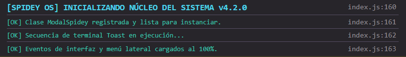
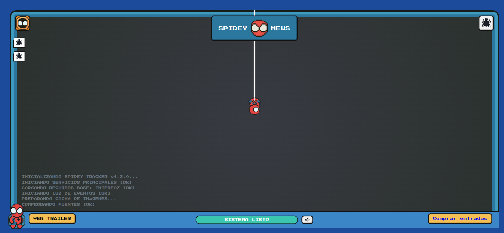
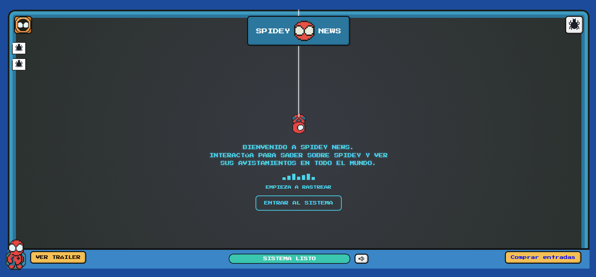
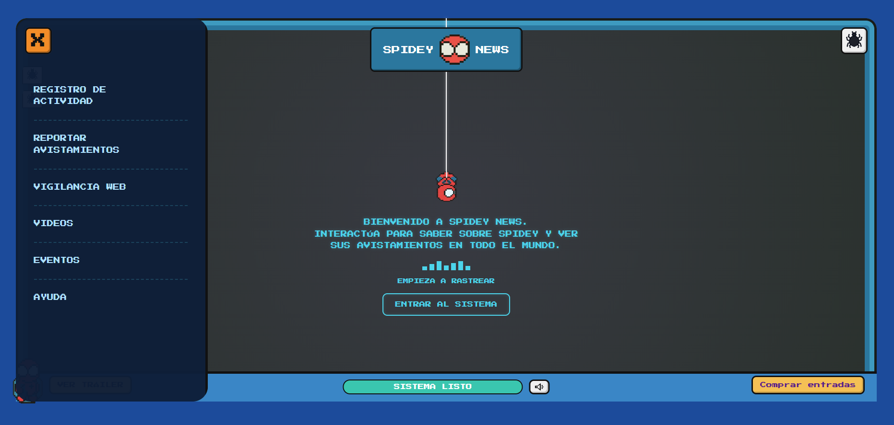
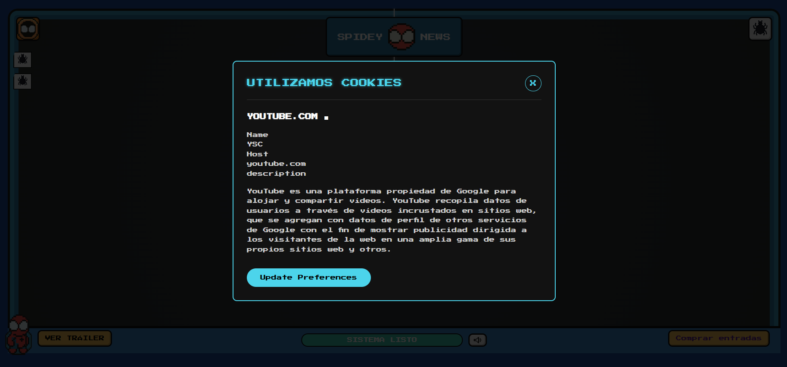

# Librería de Componente Visual con JS

**Autor:** Magali Sarai Diego Revilla  
**Proyecto:** Lbrería JavaScript reutilizable que incluye componentes visuales interactivos.
**Fecha de entrega:** 27 de Septiembre de 2026.

# Utilería JS - Librería de Validaciones

Una librería desarrollada en Vanilla JavaScript, HTML5 y CSS3 que proporciona componentes visuales interactivos para aplicaciones web. Su propósito es facilitar la integración de elementos de interfaz de usuario avanzados (modales, menús deslizables, notificaciones de tiempo y barras de progreso) manteniendo una estética retro "Sci-Fi HUD" altamente personalizable y reutilizable.

## Qué problema resuelve?

Al desarrollar interfaces gráficas es común depender de frameworks pesados (como React o Bootstrap) para lograr interactividad. Esta librería resuelve la necesidad de tener componentes UI dinámicos, eficientes y completamente reutilizables utilizando únicamente tecnologías web nativas, optimizando el rendimiento y manteniendo un control absoluto sobre el DOM además de mostrarse visualmente atractivo para demostrar dinámismo y versatilidad al utilizar los elementos con un propósito netamente decorativo.

---

# Estructura del proyecto

```
/Actividad3
│── README.md
│── index.html│
├── css
│   └── styles.css
│
├── js
|   └── index.js
└── img
|   └── arana.png
|   └── icono-ojo-naraja.png
|   └── logo.png
(etc,etc)
```

---

# Instalación
Para utilizar la librería, debes vincular la hoja de estilos en el <head> y el script principal antes de cerrar la etiqueta head asegurando el uso del atributo defer para la correcta carga del DOM.

```html
<link rel="stylesheet" href="css/style.css">
<script src="js/index.js" defer></script>
```
---

# Componentes de la librería

## 1. Modal Reutilizable (Clase ModalSpidey)

Genera ventanas emergentes dinámicas (Pop-ups) inyectando el HTML directamente desde JavaScript. Permite instanciar múltiples modales con diferente contenido sin saturar el código fuente.

**Características:**

- Cierre automático al hacer clic en el fondo oscuro (overlay), en la 'X' o en el botón de acción.
- Animación de escala fluida.

### Código js

```javascript
const modalTrailer = new ModalSpidey({
    titulo: 'UTILIZAMOS COOKIES',
    contenido: `
        <h4>YOUTUBE.COM &#9632;</h4>
        <p>YouTube es una plataforma para alojar y compartir vídeos...</p>
    `,
    textoBoton: 'UPDATE PREFERENCES'
});

document.getElementById('btnTrailer').addEventListener('click', () => {
    modalTrailer.abrir();
});
```
---

## 2. Terminal Toast Animada

Simula una secuencia de arranque de sistema imprimiendo líneas de texto de forma asíncrona.

**Características**

- Reacciona al tiempo utilizando recursividad.
- Se desvanece de forma automática al finalizar la lectura del arreglo de nodos.

### Código js

```javascript
let lineaActual = 0;
const tiempoEntreLineas = 700; 

function mostrarSiguienteLinea() {
    if (lineaActual < lineasTerminal.length) {
        lineasTerminal[lineaActual].style.display = "block";
        lineaActual++;
        setTimeout(mostrarSiguienteLinea, tiempoEntreLineas);
    } else {
        setTimeout(() => {
            contenedorTerminal.style.transition = "opacity 0.5s ease";
            contenedorTerminal.style.opacity = "0";
            setTimeout(() => contenedorTerminal.style.display = "none", 500);
        }, 2500);
    }
}
```
---

## 3. Barra de Progreso Dinámica

Elemento visual que reacciona a un intervalo de tiempo programado, calculando su velocidad en base a la duración del componente Toast.

**Características**

- Modifica dinámicamente la propiedad CSS width.
- Al llegar al 100%, cambia su estado visual (color) y actualiza el texto.

### Código js

```javascript
let porcentajeProgreso = 0;
const intervaloCarga = duracionTotalCarga / 100; 

function actualizarProgreso() {
    if (porcentajeProgreso >= 100) {
        clearInterval(intervaloProgreso);
        textoProgreso.innerText = "SISTEMA LISTO";
        barraProgreso.style.backgroundColor = "var(--borde-verde)"; 
    } else {
        porcentajeProgreso++;
        barraProgreso.style.width = porcentajeProgreso + "%";
    }
}
```
---

## 4. Menú Deslizante (Slider Lateral)

Un menú de navegación oculto tras una máscara de recorte (overflow: hidden) que se desliza hacia la pantalla.

**Características**

- Reacciona al evento click del usuario.
- Lógica de validación UX para cerrarse automáticamente si el usuario hace clic afuera.

### Código js

```javascript
btnAbrirMenu.addEventListener('click', () => {
    menuLateral.classList.add('activo');
});

document.addEventListener('click', (evento) => {
    if (!menuLateral.contains(evento.target) && 
        !btnAbrirMenu.contains(evento.target) && 
        menuLateral.classList.contains('activo')) {
        menuLateral.classList.remove('activo');
    }
});
```
---

# Integración del proyecto

La librería fue utilizada para orquestar la interfaz principal del proyecto Spidey News.

## Secuencia de Arranque

El sistema encadena los componentes: al terminar la carga de la Barra de Progreso y la Terminal Toast, el JavaScript dispara automáticamente la aparición del Panel Central de Bienvenida alterando sus clases CSS.

---

## Navegación y Modales

El botón superior de los ojos interactúa directamente con el Menú Deslizante, mientras que el botón amarillo "Ver trailer" inferior invoca la clase del Modal Reutilizable. Los demás componentes (o botones blancos) son puramente decorativos.

---

# Capturas de pantalla

## Secuencia de Arranque (Progreso y Terminal)



---

## Componentes funcionando






---

# Video demostrativo


---

# Tecnologías utilizadas

- HTML5
- CSS3
- Vanilla JavaScript
